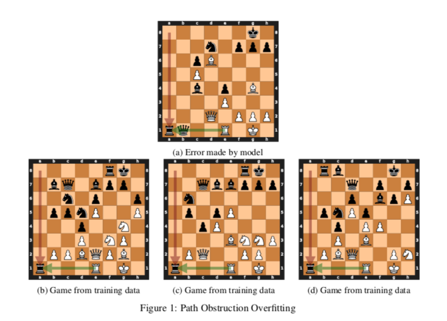
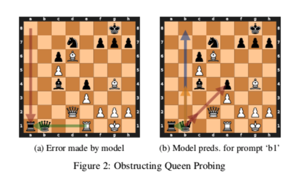
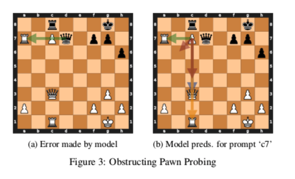
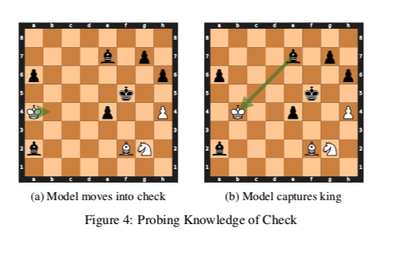
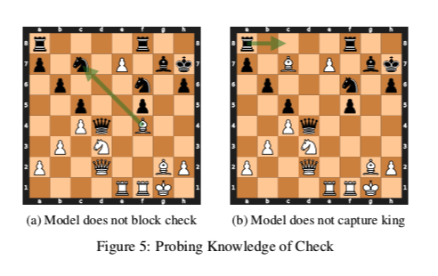
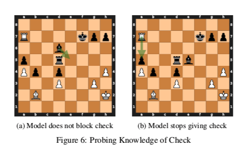

This is the write-up for my final project in CSE 573 (Artificial Intelligence) at the University of Washington last quarter. It's a bit dense because it's intended as a paper, not a blog post, but I think the pictures are fun to look at, so I'm putting it up. I really love the paper this project was based on (you can find it [here](https://arxiv.org/abs/2102.13249)), because I love interpretability *and* chess, and I might do some extensions to this in the future.   

## Introduction

One of the functions of language is communicating information about the state of the world, and humans who use language are able to track world state throughout a single utterance as well as the course of a conversation. Language models are often able to generate language that seems, on the surface, to reflect state-tracking, but because of the black-box nature of these models, it is difficult to know what kind of information they are keeping track of, and how they are representing it.

A recent paper, called Learning Chess Blindfolded (Toshniwal et al. 2021), proposes to study questions of state tracking by reducing the problem to the domain of chess. They train a model with GPT-2 architecture on data from 100,000 chess games played by humans, where each move is notated by a token representing its start square and end square on the board. They evaluate the model on 1000 games and find that, given the start square of the last move, the model predicts a legal ending square in 97.7\% of those games, leaving 23 games where the model predicted an illegal move.

Those errors are categorized by Toshniwal et al. (2021) into three categories, two of which I analyze in this paper: Pseudo-legal and Path Obstruction. Pseudo-legal errors are moves that either leave or put the king in check. Path obstruction errors are moves where the model predicts an ending square that is unreachable due to intervening pieces. Their categorization is exhaustive of the types of errors, but they don’t perform any further probing tasks to determine why the models make these specific mistakes, i.e. what information the model is missing from its state representation.

My project proposes to investigate the internal state of the model on the 22 examples where it makes either Pseudo-legal or Path Obstruction errors. The probing tasks in this paper go beyond the top prediction by the model to look at moves that are predicted for other pieces on the board and how the model would continue the game after the first predicted move. I also look at bigram frequency data to determine how much of the model’s behavior is driven purely by statistical co-occurrence rather than state tracking informed by the previous tokens.

## Preliminaries

All of the analysis below is done solely on the 22 games for which the model made an illegal move in its prediction for the destination square of the final move. The goal of these probing tasks is to find out more about the state knowledge of the model at the point in the game where it is asked to make a prediction. Relevant aspects of state knowledge for Path Obstruction and Pseudo-legal errors are piece placement/identity and whether or not the king is in check, which I probe using two different tasks. Another form of error analysis I perform is analyzing the frequency of bigram move sequences in the training data, which helps to illuminate whether the model is making moves based on state knowledge or statistical heuristics.

## Experiments

### Bigram Frequency

In order to determine the extent to which the model was overfitting to simple token sequences in its training data, I looked at the bigram frequency of the last two moves of the games. This measure applies to both kinds of errors. 

For each of the 22 games, I calculated the training set probability of the predicted square given the previous move and the starting square of the final move. As an example from one of the errors by the model, when it was given a game prefix that ended in `…a8a1 e1`, the model predicted `a1`. To find the probability of the predicted token following the previous tokens, I divided the count of `a8a1 e1a1` in the training data by the count of `a8a1 e1` in the training data. 

#### Analysis
78\% of the time that the model saw `a8e8 e1` in the training data, `a1` was the following token. For this particular example, this behavior strongly points towards overfitting on the model’s part, since it seems to prefer to make moves that it saw frequently, rather than moves that make sense in the context of the board. 
 
The percentages in the table below represent how often the model-predicted token followed the move-and-a-half prefix in the training data, for both types of errors individually and together.

|        | Path Obstruction | Pseudo-Legal | All    |
|--------|------------------|--------------|--------|
| Mean   | 13.2\%           | 12.3\%       | 12.7\% |
| Median | 4.5\%            | 3.7\%        | 3.7\%  |

Figure 1 below shows an instance of overfitting, where the model has high confidence in the move `e1a1` because of high training set frequency and does not consider the intervening Queen.

It’s clear from the difference between the means and medians that some examples are more affected by the statistical heuristics than others. In cases where the frequency of the bigram is low or zero, frequency is likely not the reason for the mistake. To further narrow down possible errors in state-tracking, I performed two more probing tasks, discussed below.

### Path Obstruction

When looking at any given path obstruction error, it’s not clear whether the model is ignoring what it knows about the board state in favor of making a frequently-seen move, or if the model legitimately is unaware of the existence of the piece it’s trying to move through. One way to probe the model for its knowledge of the piece on a given square, is to ask it to choose an end square for that square as the start square, and judge whether its top K (K=5 in this paper) suggestions are legal moves for the piece that is actually on that square.

There are a few issues with this approach. One is that sometimes the piece causing the obstruction is of the opposite color (say, black) to the piece trying to move through it (which is say, white). If we try to elicit a prediction for the obstructing piece, the model will think that it is still white’s turn, and this might introduce some uncertainty to the model’s state tracking. In fact, in cases like Figure 2 below, the black queen tries to capture her own pawn and rook because it is white’s turn based on the number of moves that have been made on the board. Since the moves are all legal paths for a queen on an empty board, it still seems to indicate that the model knows the identity of the piece on that square, but the mismatch in turn colors is a potential confounder.

Another issue is that the model will still give predictions for empty squares, so it’s possible that the model’s internal state does not know a piece is on that square, but since we’re probing it, it makes guesses. With this probing task alone, it isn’t possible to tell whether the model is only guessing moves that happen to suit the piece that is actually on that square. However, when you query the model for moves for a square that is empty on the true board, it will usually provide random moves that could not all come from the same piece, or it will mimic moves from the closest piece (which in this case is a rook). Because of this, we can be reasonably sure that if the model’s top 5 moves are all legal queen moves, the model knows the identity of the piece on that square is a queen.

#### Analysis

Out of the ten path obstruction errors, the model was able to find at least 1 legal move for nine of the obstructing pieces. When the obstructing piece was not a pawn, on average 86.6\% of the top 5 moves were legal for that piece type. This indicates that the model likely understands the type of piece that is on that square, and therefore the path obstruction error was made in spite of that state knowledge. When the obstructing piece was a pawn, often there were no legal moves for that pawn (since they are only able to move forward one square or capture diagonally, which are not possible moves in many positions). In these cases, I considered any of the three squares directly in front of the pawn a legal move, even if they were not legal from that board position. Two of the pawn errors found one of these legal moves in their top 5 predictions, and one did not find any (shown in Figure 3 below). The decrease in accuracy on pawn move suggestions seems to indicate that the model’s board state might lose track of pawns more easily than the major pieces.

### Pseudo-Legal

As discussed earlier, we cannot assume that high training set frequency is the source of all erroneous move predictions. With pseudo-legal moves specifically, one possible source of error is that the model doesn’t understand the concept of check and doesn’t have a way of representing it in its internal state. Check was not explicitly notated in the model’s training data, so the model would have had to build its own understanding of why the king is always moved out of the way of attacking pieces (or the attack is blocked, or the attacking piece captured). It’s possible that the signal from the training data that remaining in check is illegal was not strong enough, and so when the model sees that its king is in check, it doesn’t react in a legal way.

One interpretation of the rules of chess that fits the training data is simply that players have a strong preference not to leave their king attacked, and that therefore the king is a high-value piece, but not necessarily one that it is illegal to allow to be captured. Since many games of chess played between humans end in resignation before checkmate occurs, the training data may not contain enough information to inform the model that giving checkmate (i.e. inevitable king capture on the next turn) is the winning condition of the game. 

Since the reason the king cannot remain in check is because his capture would end the game, one way to probe the model for its knowledge about check as part of the board state is to ask it to predict a move for the checking piece. If we allow the model to make its predicted pseudo-legal move that leaves the king in check, and then ask it to predict a starting and ending square for the next move, we expect it to try to capture the king if it knows that the king is in check, and that inevitable king capture ends the game.

An issue with this approach is that the model has never seen a king being captured in its training data. Capturing the king is not a legal move in chess, because leaving one’s king in check is also not a legal move. Because of this, we might not expect the model to try to capture the king, and it’s also not clear that capturing the king would indicate that the model is trying to bring about the winning condition of the game. However, this method is one of way of determining whether the model is aware that the king is the highest-value piece on the board.

#### Analysis

Out of 12 pseudo-legal move errors, when the model is allowed to make those errors and then make a move for the other side, it only captures the king in 3 of those board states. In 7 out of the other 9 boards, it leaves the king in check, but makes a different capture or moves to an empty square. In 2 out of those 9 boards, it moves the checking piece away from the king. The model’s predictions on these examples seems to indicate that it doesn’t fully understand the mechanics of check, why it is good for one side and not the other, and what the winning conditions of the game are. Some examples of these boards are shown in Figure 4-6 below.

## Discussion

Based on the error analysis in this paper, particularly the bigram frequency statistics and pseudo-legal probing task, I believe this model could be improved by changes to its training data. The model is trained on human chess games, which leads to artifacts in the data that are irrelevant to the task of learning legal chess moves, such as games ending before checkmate and move choices tending towards "good" rather than just "legal” moves, which might lead the model to think certain moves are good in all situations. Future work could try retraining Toshniwal et al.’s model on exclusively games that end in checkmate, or on games played by generating random legal moves until checkmate. 

The findings in this paper also replicate, on a smaller scale, problems with Transformer models trained on natural language data. For instance, the more times the chess model saw two moves in sequence, the more likely it was to be confident that those two moves should follow each other even in different circumstances. Similarly, language models learn bias from statistical co-occurrences of words, regardless of why those words co-occur (a relationship grounded in the real world vs. a bias in human cognition). These biases are hard to correct without data to contradict them. Additionally, the model's inconsistent understanding of check seen in this project shows the difficulty of learning about the existence of properties of the game that are not overtly present in the training data. In the same way, there are likely aspects of language or world knowledge that language models cannot grasp fully on the basis of training data, because they  only implicitly or infrequently occur.

## Conclusion

Although the model performs extremely well in general, there are times when the effect of move frequency in its training data causes it to make an error, either in spite of or in addition to defects in its internal state representation. The path obstruction probing task in this paper helps to show that the model generally knows the identity of the pieces that it tries to move through, and therefore is aware of their existence in its state-tracking, with one possible exception being pawns. The pseudo-legal probing task does not definitively show that the model doesn’t understand check, but it offers some evidence towards that claim, and further probing tasks could illuminate more about how the model represents check in its state tracking. 

The potential relationships between this project and GPT-2 as trained on language data are only potential. It's possible that these conclusions do not transfer across these domains. However, the importance of good data is relevant to all kinds of models, and the results in this paper open up further questions to be asked about state-tracking as performed by a Transformer model.

### Reference~~s~~

Toshniwal, S., Wiseman, S., Livescu, K., \& Gimpel, K. (2021). Learning Chess Blindfolded: Evaluating Language Models on State Tracking.
 